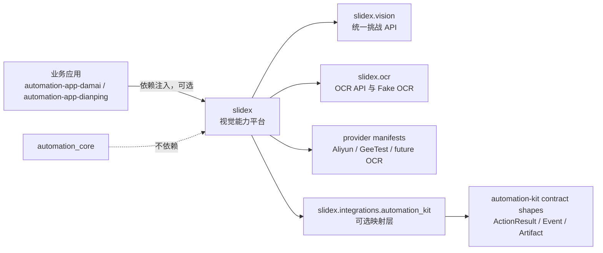

# 将 slidex 升级为 automation-kit 生态唯一视觉能力平台，并归档 automation-plugin-ocr

## 结论

`slidex` 是 `automation-kit` 生态唯一推荐的视觉能力平台，统一承接滑块验证码、OCR、截图识别、视觉元素识别、人工兜底、artifact 与 telemetry 协议。`automation-plugin-ocr` 直接进入归档废弃阶段，不再新增功能，不提供兼容 shim，也不再作为生态推荐插件。

这份文档是当前设计准绳。历史执行步骤仍保留在 `docs/superpowers/plans/2026-06-18-automation-kit-vision-platform.md`，用于追溯实现过程。当前代码基线为 `b5e6521 docs(阶段8): 固化 automation-kit 视觉平台基线`。

## 背景与目标

`slidex` 原本以滑块验证码求解为核心，但它已经具备 `SliderSolver`、provider registry、Aliyun NoCaptcha、GeeTest、CDP 模式、轨迹池、远程人工兜底、telemetry、CLI JSON 输出和 provider 测试等资产。最新目标是把这些资产上升为通用视觉挑战平台，而不是继续让 `automation-plugin-ocr` 独立发展。

正式需求标题：

```text
将 slidex 升级为 automation-kit 生态唯一视觉能力平台，并归档 automation-plugin-ocr
```

## 非目标

- 不把 `slidex` 做成 `automation-kit` 的硬依赖。
- 不让 `automation_core` 出现 `slidex`、OCR、captcha、厂商名、浏览器或 Appium 概念。
- 不要求业务应用迁移到 `slidex` 的生命周期模型。
- 不在 `automation-plugin-ocr` 里提供兼容 shim。
- 不在第一阶段默认引入重型 OCR 引擎；真实 OCR 后端通过 optional extras 或 provider 扩展。

## 生态边界



边界规则：

- 应用层通过依赖注入选择是否使用 `slidex`。
- `automation-kit` 可以定义通用 action result、event、artifact 形状，但不能知道 `slidex` 的存在。
- `slidex` 单向适配到 `automation-kit`，适配层位于 `slidex.integrations.automation_kit`。
- `automation-app-damai` 可以在 app 层构造 `PLAYWRIGHT_PAGE` 滑块请求、调用注入的 slidex solver，并转换 slidex 结果。
- `automation-app-dianping` 可以在 app 层构造 `ANDROID_SCREENSHOT_BYTES` 图片文本请求、调用注入的 slidex solver，并转换 slidex 结果。
- 两个应用仓默认离线测试都不依赖 `slidex`、浏览器、设备或网络。

## 公共 API

### 统一视觉挑战 API

```python
from slidex.vision import (
    VisualChallengeRequest,
    VisualChallengeResult,
    VisualChallengeSolver,
    ChallengeType,
)
```

`ChallengeType` 必须至少支持：

- `slider_captcha`
- `ocr_text`
- `image_text`
- `visual_element`
- `manual_fallback`

`VisualChallengeResult` 是 SDK、CLI、adapter 与 artifact 收集的统一结果模型：

```python
from dataclasses import dataclass, field
from typing import Any, Dict, List, Optional

@dataclass
class VisualChallengeResult:
    success: bool
    challenge_type: ChallengeType
    provider: str
    confidence: float = 0.0
    duration_ms: float = 0.0
    error_code: Optional[str] = None
    retryable: bool = False
    cookies: Optional[Dict[str, str]] = None
    artifacts: List[VisionArtifact] = field(default_factory=list)
    metadata: Dict[str, Any] = field(default_factory=dict)
```

当前实现状态：

- `slider_captcha` 可通过 `VisualChallengeSolver` 路由到 `SliderSolver`。
- `ocr_text` 与 `image_text` 可通过 `VisualChallengeSolver` 路由到 OCR extractor。
- `SliderSolver.solve()`、`solve_on_existing_page()` 保持兼容。
- `solve_on_page(page, ...)` 支持调用方持有的 Playwright `Page`，并在 finally 中清理 response listener 与 CDP session。
- CLI JSON 输出包含统一视觉结果字段，同时保留旧字段兼容现有调用方。

### OCR API

```python
from slidex.ocr import OcrTextExtractor, OcrResult, FakeOcrExtractor
```

`OcrResult` 字段：

- `text`
- `confidence`
- `boxes`
- `language`
- `provider`
- `metadata`

输入能力：

- `image_bytes`
- `image_path`
- `roi`
- 未来 Android screenshot bytes，通过 `VisionContext.ANDROID_SCREENSHOT_BYTES` 预留

约束：

- `FakeOcrExtractor` 必须支持离线测试。
- OCR 不依赖浏览器即可运行。
- Android screenshot OCR 不把 Appium 作为硬依赖。
- 本地 OCR、云 OCR、Android OCR 通过后续 optional provider 扩展。

### automation-kit 可选适配

```python
from slidex.integrations.automation_kit import (
    to_action_result,
    to_artifacts,
    to_events,
)
```

适配规则：

- 不安装 `automation-kit` 时，`slidex` 核心可导入、可测试、可运行。
- 默认返回普通 dict/list 结构，且必须 JSON 可序列化。
- 安装 `slidex[automation-kit]` 或把 `automation-kit` 放入 `PYTHONPATH` 后，可以返回 native `ActionResult`、`ArtifactHandle`、`EventEnvelope`。
- artifact metadata 必须脱敏，不能默认写出 cookie/token/secret/password/authorization。

## Provider Manifest

所有 provider 必须声明能力，不再只注册类名。

```json
{
  "name": "geetest",
  "version": "0.1.0",
  "challenge_types": ["slider_captcha"],
  "contexts": ["playwright_page", "cdp"],
  "requires_network": false,
  "produces_artifacts": ["screenshot", "crop", "trajectory", "telemetry"]
}
```

验收要求：

- 可列出所有 provider。
- 可按 challenge type 过滤 provider。
- 可按 context 过滤 provider。
- 自动检测时记录 provider 决策过程。

## Artifact 与可观测性

每次视觉处理都必须尽量留下可审计证据。失败时也必须产生 error artifact 或 telemetry。

Artifact 类型包括：

- 原始截图
- 裁剪区域
- 匹配图
- OCR 结果
- 轨迹数据
- provider 决策
- telemetry JSON

稳定结构：

```python
VisionArtifact(
    artifact_type="telemetry",
    path=Path("artifacts/run-id/telemetry/events.jsonl"),
    metadata={"run_id": "..."},
)
```

监控建议：

- 每次求解记录 `run_id`、`challenge_type`、`provider`、`duration_ms`、`confidence`、`success`、`error_code`、`retryable`。
- 滑块路径额外记录 `distance`、`distance_source`、`trajectory_mode`、`fallback_used`、`slide_code`。
- OCR 路径额外记录 `language`、`box_count`、`input`、`roi`。
- 人工兜底路径额外记录 `session_id`、`timeout_s`、`audit`，token 永远脱敏。
- 真实 E2E 调用时以 `run_id` 关联业务日志、slidex telemetry、artifact 目录和 automation-kit event。

## 人工兜底平台化

人工兜底不再只服务滑块。目标形态：

- `slider_captcha` 可进入人工兜底。
- `ocr_text` 可进入人工确认或修正。
- fallback 结果返回统一 `VisualChallengeResult`。
- token、session、timeout、审计日志规则稳定。

当前实现已完成 session/audit/result contract 的平台化；浏览器控制页仍以滑块交互为主，后续需要补通用视觉挑战 UI。

## automation-plugin-ocr 处理策略

`automation-plugin-ocr` 直接归档废弃：

- README 标记 deprecated / archived。
- 文档说明迁移到 `dengyie/slidex`。
- 不再新增功能。
- 不再作为 `automation-kit` 生态推荐插件。
- 不提供 `automation_plugin_ocr` 到 `slidex.ocr` 的兼容 shim。
- 外部仓库确认无引用后，可以在 GitHub 上 archive repository。

迁移目标：

- `automation-app-damai` 通过 lazy helper 构造 `PLAYWRIGHT_PAGE` 滑块挑战请求，通过 `solve_slider_visual_challenge(...)` 调用注入的 slidex solver，并通过 `slidex.integrations.automation_kit` 转换结果。
- `automation-app-dianping` 通过 lazy helper 构造 `ANDROID_SCREENSHOT_BYTES` 图片文本请求，通过 `solve_android_screenshot_visual_challenge(...)` 调用注入的 slidex solver，并通过 `slidex.integrations.automation_kit` 转换结果。
- `automation-kit` 生态文档从 `automation-plugin-ocr` 改为 `slidex: visual challenge platform for captcha, OCR, screenshot recognition, and manual fallback`。
- 兼容矩阵增加：

```yaml
slidex:
  - OCR API smoke tests
  - visual challenge result contract tests
  - optional automation-kit integration tests
```

## 第一阶段验收标准

必须满足：

- `automation-plugin-ocr` 不再被任何应用仓引用。
- `automation-app-damai` 可选安装 `slidex` 后能构造 `PLAYWRIGHT_PAGE` 滑块挑战请求、调用 solver 并转换结果。
- `automation-app-dianping` 可选安装 `slidex` 后能构造 `ANDROID_SCREENSHOT_BYTES` 图片文本请求、调用 solver 并转换结果。
- `automation-kit` 文档只推荐 `slidex` 作为视觉能力平台。
- `slidex` 同时支持 `slider_captcha` 和 `ocr_text`。
- `slidex` 的统一结果可以被 `automation-kit` 转为 action result、artifact、event。
- `automation-kit` 全量测试不安装 `slidex` 也通过。
- 两个应用仓默认离线测试在未安装 `slidex`、无浏览器、无设备、无网络时仍通过。

当前仓库验证：

- `pytest -q`: `243 passed, 1 skipped`
- `PYTHONPATH=/Users/mango/project/codex/automation-kit pytest -q tests/test_automation_kit_integration.py`: `6 passed`
- Damai slidex compatibility slice: `2 passed, 4 deselected`
- Dianping slidex compatibility slice: `2 passed, 4 deselected`
- Damai live helper slice: `2 passed, 6 deselected`
- Dianping live helper slice: `3 passed, 6 deselected`
- `git diff --check`: passed

## 当前跨仓基线

- `slidex`: `b5e6521 docs(阶段8): 固化 automation-kit 视觉平台基线`
- `automation-kit`: `83e5169 docs(阶段7): 复核 slidex 最新视觉契约`
- `automation-app-damai`: `3ccd788 feat(阶段5): 补齐 damai live 视觉调用边界`
- `automation-app-dianping`: `3a1c94e feat(阶段5): 补齐 dianping 截图视觉调用边界`
- `automation-plugin-ocr`: `1b44c77 docs: 归档 OCR 插件并指向 slidex`

当前已完成生产可调用 helper 边界：Damai/Dianping 已具备请求构造、solver 调用和结果转换 helper。仍未完成的是依赖目标环境的 opt-in E2E：真实 Damai Playwright challenge page 和真实 Dianping Appium/ADB screenshot capture。

## 版本线

### `slidex 0.4`: 统一 Vision API + OCR

完成目标：

- 新增 `slidex.vision`。
- 新增 `slidex.ocr`。
- 新增 `FakeOcrExtractor`。
- 新增统一 `VisualChallengeResult`。
- `slider_captcha` 与 `ocr_text` 都可通过平台 API 调用。

### `slidex 0.5`: automation-kit optional integration + artifact 标准化

完成目标：

- 新增 `slidex.integrations.automation_kit`。
- `VisualChallengeResult` 可映射到 action result、artifact、event。
- artifact path/metadata 稳定且 JSON 可序列化。
- provider manifest 与 provider filtering 生效。

### `slidex 0.6`: manual fallback 平台化 + CLI/API 统一

完成目标：

- 人工兜底结果进入 `VisualChallengeResult`。
- session/audit/token/timeout 规则稳定。
- CLI 输出与 Python SDK 统一，同时保留旧字段兼容。

### `slidex 1.0`: 公共协议冻结

目标：

- 冻结 `VisualChallengeRequest`、`VisualChallengeResult`、`VisionArtifact`、`ProviderManifest`、`OcrResult`、automation-kit adapter 行为。
- 完成 provider 生态拆分策略文档。
- 建立跨仓兼容测试基线。

## 长期 provider 生态

后续拆分方向：

- `slidex-provider-geetest`
- `slidex-provider-aliyun`
- `slidex-provider-ocr-local`
- `slidex-provider-ocr-cloud`
- `slidex-provider-android-vision`
- `slidex-provider-manual`

`slidex` 主仓长期只保留核心协议、基础 provider、测试假实现和平台文档。
